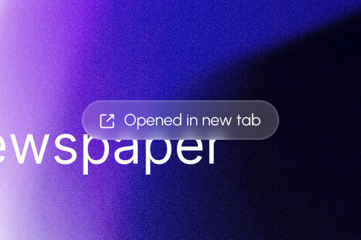

# Better Toast — Zen Browser Mod

A polished, frosted-glass pill toast notification for [Zen Browser](https://zen-browser.app/).



## Features

- **Frosted glass** — `backdrop-filter: blur` with saturation boost, matching Zen's native aesthetic
- **Auto dark / light** — white-tinted glass on dark backgrounds, dark-tinted glass on light backgrounds, driven by `prefers-color-scheme`
- **4-way position control** — choose top or bottom (vertical) and left, center, right, or auto (horizontal) from Zen's mod settings panel
- **Safe minimum offset** — no longer clips to the screen edge when `zen.theme.content-element-separation = 0`
- **Sidebar-aware default** — auto mode places the toast on the opposite side from your sidebar
- **Accent hover** — toast highlights in your Zen accent color on hover with a matching glow

## Install from Zen Mods Store

Search **"Better Toast"** in Zen Browser → Settings → Mods → Browse.

## Manual Install

1. Open Zen Browser → Settings → Mods
2. Click **Add from file** (or drag & drop)
3. Select the folder containing `chrome.css` and `metadata.json`
4. Enable the mod

## Settings

| Setting | Options | Default |
|---|---|---|
| Vertical Position | Top / Bottom | Top |
| Horizontal Position | Auto / Left / Center / Right | Auto |

**Auto** horizontal mode is sidebar-aware: it places the toast on the right when your sidebar is on the left, and on the left when your sidebar is on the right.

## Customisation

All visual variables are at the top of `chrome.css`:

```css
--mbt-blur:         12px;    /* backdrop blur amount */
--mbt-radius:       999px;   /* pill shape — lower for rounded rect */
--mbt-padding:      8px 16px;
--mbt-font-size:    12px;
--mbt-desc-size:    10px;
--mbt-font-weight:  500;
--mbt-max-width:    320px;
--mbt-min-offset:   12px;    /* minimum edge gap when separation = 0 */
```

## How preferences work

Position preferences use Firefox's `-moz-pref()` media query API:

```css
@media (-moz-pref("mod.better-toast.position-v", "bottom")) { … }
@media (-moz-pref("mod.better-toast.position-h", "center")) { … }
```

## License

MIT
